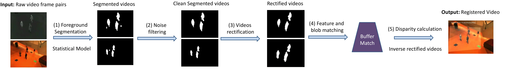
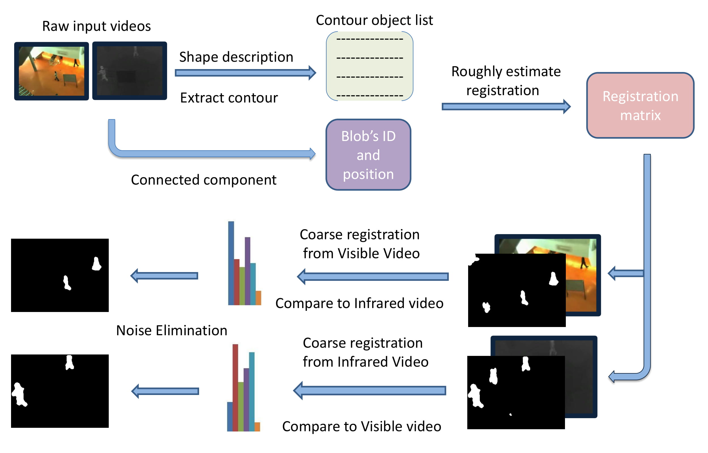
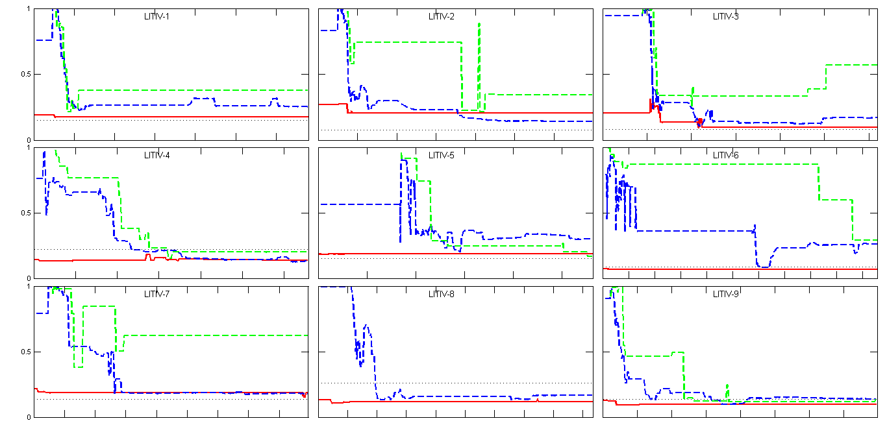

This repository contains the C/C++ code of the CVPRW paper ["Non-planar Infrared-Visible Registration for Uncalibrated Stereo Pairs"](http://openaccess.thecvf.com/content_cvpr_2016_workshops/w9/papers/Nguyen_Non-Planar_Infrared-Visible_Registration_CVPR_2016_paper.pdf) [[Supplementary material](http://www.polymtl.ca/litiv/doc/NguyenCVPRW2016-supp.pdf)]

### Non-planar Infrared-Visible Registration for Uncalibrated Stereo Pairs

By [Dinh-Luan Nguyen](https://scholar.google.com/citations?user=i6wx2AEAAAAJ&hl=en), [Pierre-Luc St-Charles](https://scholar.google.com/citations?user=30mr9vYAAAAJ&hl=en), [Guillaume-Alexandre Bilodeau](https://scholar.google.com/citations?user=OU5TZScAAAAJ&hl=en)

    

Figure1. Proposed framework

	

Figure2. Segmentation and spurious blobs filtering strategy

	

Figure3. Comparison results with state-of-the-art

### Citing IRVisReg

If you find IRVisReg useful in your research, please consider citing:

    @inproceedings{Nguyen_2016_CVPR_Workshops,
        Author = {Nguyen, Dinh-Luan and St-Charles, Pierre-Luc and Bilodeau, Guillaume-Alexandre},
        Title = {Non-Planar Infrared-Visible Registration for Uncalibrated Stereo Pairs},
        Booktitle = {The IEEE Conference on Computer Vision and Pattern Recognition (CVPR) Workshops},
        Month = {June},
        Year = {2016}
    }

### Requirements: 
OpenCV 3.0
# Run code
1. Download the dataset and change dataset path at line 11 in `main.cpp` file.
2. Run the `main.cpp` file to explore!
